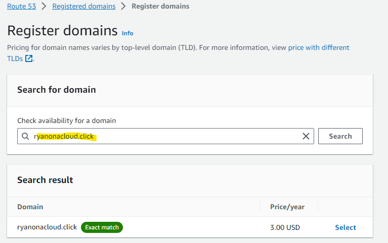

# websitelaunchAWS
Launching a website on AWS

## Initial Steps to Hosting Website with Custom Domain

- Set up a custom domain name using Amazon Route 53:  can use Amazon Route 53, a domain name system (DNS) service provided by Amazon Web Services, to create a unique and personalized domain name for  website. This allows  to have a web address that reflects  brand or purpose.

- Host  website on an Amazon S3 Bucket: To make  website accessible on the internet,  can use an Amazon S3 Bucket, a scalable and cost-effective storage service. By storing  website's files in an S3 Bucket,  ensure that they are securely stored and easily retrievable.

- Enable static website hosting and link the domain to the S3 bucket: Once  website files are stored in the S3 Bucket,  can enable static website hosting for the bucket. This feature allows  to serve  website's content directly from the S3 Bucket, and can then configure Amazon Route 53 to route traffic from  custom domain to the S3 Bucket, making  website accessible under  chosen domain name.

## Route 53 Domain

- Navigate to Route 53 in AWS by using the search

- Press Register Domain and check desired domain availability. I used ryanonacloud.com and it was available.

- Selected the domain and completed Pricing and Contact information. I turned off autorenew and set it up for 1 year. The Top level Domain(TLD) was the cheapest option for this project ".click"